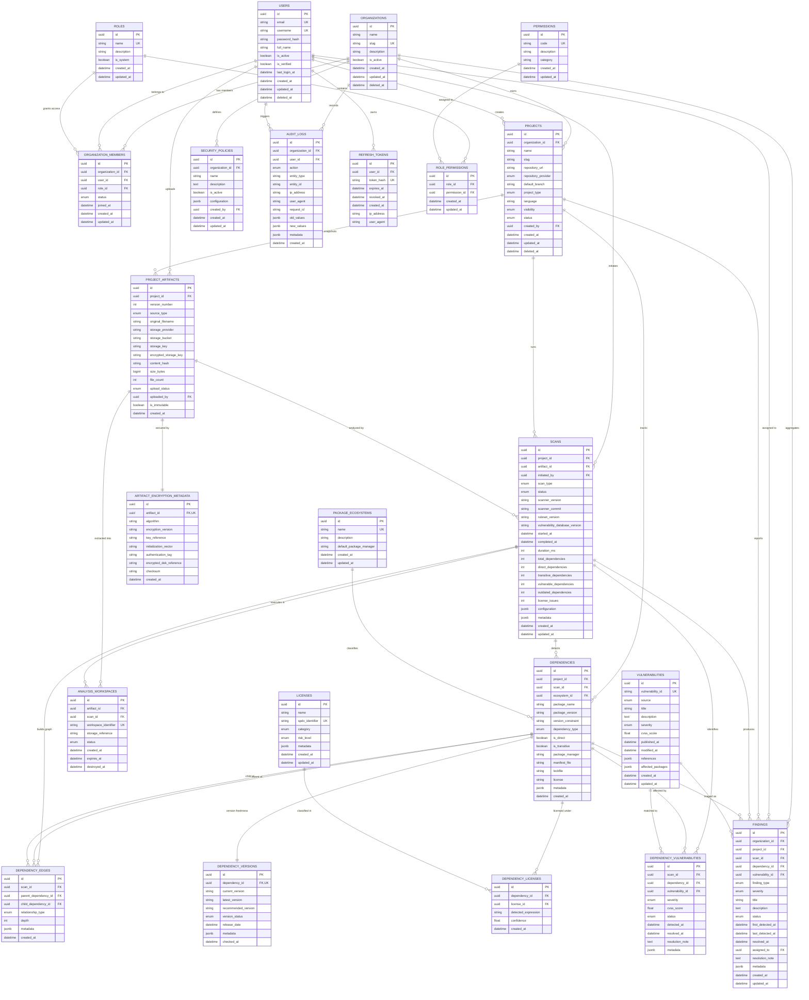

# Dependency Hub — Database Entity Relationship Diagram (ERD)

```mermaid
erDiagram
    ORGANIZATIONS ||--o{ ORGANIZATION_MEMBERS : "has members"
    ORGANIZATIONS ||--o{ PROJECTS : "owns"
    ORGANIZATIONS ||--o{ FINDINGS : "aggregates"
    ORGANIZATIONS ||--o{ SECURITY_POLICIES : "defines"
    ORGANIZATIONS ||--o{ AUDIT_LOGS : "records"

    USERS ||--o{ ORGANIZATION_MEMBERS : "belongs to"
    USERS ||--o{ REFRESH_TOKENS : "owns"
    USERS ||--o{ AUDIT_LOGS : "triggers"
    USERS ||--o{ PROJECTS : "creates"
    USERS ||--o{ PROJECT_ARTIFACTS : "uploads"
    USERS ||--o{ SCANS : "initiates"
    USERS ||--o{ FINDINGS : "assigned to"

    ROLES ||--o{ ORGANIZATION_MEMBERS : "grants access"
    ROLES ||--o{ ROLE_PERMISSIONS : "contains"
    PERMISSIONS ||--o{ ROLE_PERMISSIONS : "assigned to"

    PROJECTS ||--o{ PROJECT_ARTIFACTS : "contains snapshots"
    PROJECTS ||--o{ SCANS : "runs"
    PROJECTS ||--o{ DEPENDENCIES : "tracks"
    PROJECTS ||--o{ FINDINGS : "reports"

    PROJECT_ARTIFACTS ||--|| ARTIFACT_ENCRYPTION_METADATA : "secured by"
    PROJECT_ARTIFACTS ||--o{ ANALYSIS_WORKSPACES : "extracted into"
    PROJECT_ARTIFACTS ||--o{ SCANS : "analyzed by"

    SCANS ||--o{ DEPENDENCIES : "detects"
    SCANS ||--o{ DEPENDENCY_EDGES : "builds graph"
    SCANS ||--o{ DEPENDENCY_VULNERABILITIES : "identifies"
    SCANS ||--o{ FINDINGS : "produces"
    SCANS ||--o{ ANALYSIS_WORKSPACES : "executes in"

    PACKAGE_ECOSYSTEMS ||--o{ DEPENDENCIES : "classifies"

    DEPENDENCIES ||--o{ DEPENDENCY_EDGES : "parent of"
    DEPENDENCIES ||--o{ DEPENDENCY_EDGES : "child of"
    DEPENDENCIES ||--o{ DEPENDENCY_VULNERABILITIES : "affected by"
    DEPENDENCIES ||--o{ DEPENDENCY_LICENSES : "licensed under"
    DEPENDENCIES ||--|| DEPENDENCY_VERSIONS : "version freshness"
    DEPENDENCIES ||--o{ FINDINGS : "generates"

    VULNERABILITIES ||--o{ DEPENDENCY_VULNERABILITIES : "matched to"
    VULNERABILITIES ||--o{ FINDINGS : "triaged as"

    LICENSES ||--o{ DEPENDENCY_LICENSES : "classified in"

    ORGANIZATIONS {
        uuid id PK
        string name
        string slug UK
        string description
        boolean is_active
        datetime created_at
        datetime updated_at
        datetime deleted_at
    }

    USERS {
        uuid id PK
        string email UK
        string username UK
        string password_hash
        string full_name
        boolean is_active
        boolean is_verified
        datetime last_login_at
        datetime created_at
        datetime updated_at
        datetime deleted_at
    }

    ROLES {
        uuid id PK
        string name UK
        string description
        boolean is_system
        datetime created_at
        datetime updated_at
    }

    PERMISSIONS {
        uuid id PK
        string code UK
        string description
        string category
        datetime created_at
        datetime updated_at
    }

    ROLE_PERMISSIONS {
        uuid id PK
        uuid role_id FK
        uuid permission_id FK
        datetime created_at
        datetime updated_at
    }

    ORGANIZATION_MEMBERS {
        uuid id PK
        uuid organization_id FK
        uuid user_id FK
        uuid role_id FK
        enum status
        datetime joined_at
        datetime created_at
        datetime updated_at
    }

    PROJECTS {
        uuid id PK
        uuid organization_id FK
        string name
        string slug
        string repository_url
        enum repository_provider
        string default_branch
        enum project_type
        string language
        enum visibility
        enum status
        uuid created_by FK
        datetime created_at
        datetime updated_at
        datetime deleted_at
    }

    PROJECT_ARTIFACTS {
        uuid id PK
        uuid project_id FK
        int version_number
        enum source_type
        string original_filename
        string storage_provider
        string storage_bucket
        string storage_key
        string encrypted_storage_key
        string content_hash
        bigint size_bytes
        int file_count
        enum upload_status
        uuid uploaded_by FK
        boolean is_immutable
        datetime created_at
    }

    ARTIFACT_ENCRYPTION_METADATA {
        uuid id PK
        uuid artifact_id FK,UK
        string algorithm
        string encryption_version
        string key_reference
        string initialization_vector
        string authentication_tag
        string encrypted_dek_reference
        string checksum
        datetime created_at
    }

    ANALYSIS_WORKSPACES {
        uuid id PK
        uuid artifact_id FK
        uuid scan_id FK
        string workspace_identifier UK
        string storage_reference
        enum status
        datetime created_at
        datetime expires_at
        datetime destroyed_at
    }

    SCANS {
        uuid id PK
        uuid project_id FK
        uuid artifact_id FK
        uuid initiated_by FK
        enum scan_type
        enum status
        string scanner_version
        string scanner_commit
        string ruleset_version
        string vulnerability_database_version
        datetime started_at
        datetime completed_at
        int duration_ms
        int total_dependencies
        int direct_dependencies
        int transitive_dependencies
        int vulnerable_dependencies
        int outdated_dependencies
        int license_issues
        jsonb configuration
        jsonb metadata
        datetime created_at
        datetime updated_at
    }

    PACKAGE_ECOSYSTEMS {
        uuid id PK
        string name UK
        string description
        string default_package_manager
        datetime created_at
        datetime updated_at
    }

    DEPENDENCIES {
        uuid id PK
        uuid project_id FK
        uuid scan_id FK
        uuid ecosystem_id FK
        string package_name
        string package_version
        string version_constraint
        enum dependency_type
        boolean is_direct
        boolean is_transitive
        string package_manager
        string manifest_file
        string lockfile
        string license
        jsonb metadata
        datetime created_at
    }

    DEPENDENCY_EDGES {
        uuid id PK
        uuid scan_id FK
        uuid parent_dependency_id FK
        uuid child_dependency_id FK
        enum relationship_type
        int depth
        jsonb metadata
        datetime created_at
    }

    VULNERABILITIES {
        uuid id PK
        string vulnerability_id UK
        enum source
        string title
        text description
        enum severity
        float cvss_score
        datetime published_at
        datetime modified_at
        jsonb references
        jsonb affected_packages
        datetime created_at
        datetime updated_at
    }

    DEPENDENCY_VULNERABILITIES {
        uuid id PK
        uuid scan_id FK
        uuid dependency_id FK
        uuid vulnerability_id FK
        enum severity
        float cvss_score
        enum status
        datetime detected_at
        datetime resolved_at
        text resolution_note
        jsonb metadata
    }

    LICENSES {
        uuid id PK
        string name
        string spdx_identifier UK
        enum category
        enum risk_level
        jsonb metadata
        datetime created_at
        datetime updated_at
    }

    DEPENDENCY_LICENSES {
        uuid id PK
        uuid dependency_id FK
        uuid license_id FK
        string detected_expression
        float confidence
        datetime created_at
    }

    DEPENDENCY_VERSIONS {
        uuid id PK
        uuid dependency_id FK,UK
        string current_version
        string latest_version
        string recommended_version
        enum version_status
        datetime release_date
        jsonb metadata
        datetime checked_at
    }

    FINDINGS {
        uuid id PK
        uuid organization_id FK
        uuid project_id FK
        uuid scan_id FK
        uuid dependency_id FK
        uuid vulnerability_id FK
        enum finding_type
        enum severity
        string title
        text description
        enum status
        datetime first_detected_at
        datetime last_detected_at
        datetime resolved_at
        uuid assigned_to FK
        text resolution_note
        jsonb metadata
        datetime created_at
        datetime updated_at
    }

    SECURITY_POLICIES {
        uuid id PK
        uuid organization_id FK
        string name
        text description
        boolean is_active
        jsonb configuration
        uuid created_by FK
        datetime created_at
        datetime updated_at
    }

    AUDIT_LOGS {
        uuid id PK
        uuid organization_id FK
        uuid user_id FK
        enum action
        string entity_type
        string entity_id
        string ip_address
        string user_agent
        string request_id
        jsonb old_values
        jsonb new_values
        jsonb metadata
        datetime created_at
    }

    REFRESH_TOKENS {
        uuid id PK
        uuid user_id FK
        string token_hash UK
        datetime expires_at
        datetime revoked_at
        datetime created_at
        string ip_address
        string user_agent
    }
```
