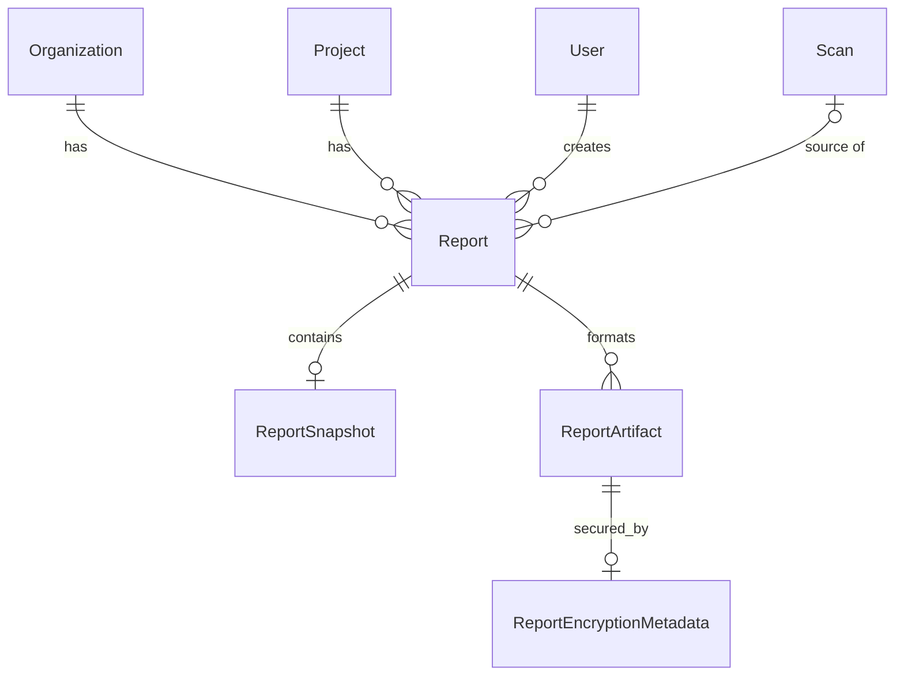

# P2.1A Model Foundation

## 1. Baseline
* **Branch**: `feat/p2-report-intelligence`
* **Commit**: `33b3146` (P1 Registry Intelligence)
* **P1 Integrity**: No P1 provider, worker, or service code was modified. Only models and their required relationship registrations were added.

## 2. Models Added
* `Report`: Top-level metadata wrapper for reports.
* `ReportSnapshot`: Immutable JSON representation of the scan.
* `ReportArtifact`: Physical rendered file artifact.
* `ReportEncryptionMetadata`: Dedicated envelope encryption tracking table (mirroring `ArtifactEncryptionMetadata`).

## 3. Relationship Graph

## 4. Cascade Matrix
* **Organization → Report**: `RESTRICT` on deletion (standard tenant protection). `cascade="all, delete-orphan"` at the ORM level on `Organization.reports` was avoided to prevent competing delete-orphan chains with Project. Normal back_populates is used instead.
* **Project → Report**: `CASCADE` on deletion. `cascade="all, delete-orphan"` at ORM level.
* **Scan → Report**: `SET NULL`. Reports survive scan deletion.
* **User → Report**: `SET NULL`. Reports survive creator deletion.
* **Report → ReportSnapshot**: `CASCADE`.
* **Report → ReportArtifact**: `CASCADE`.
* **ReportArtifact → ReportEncryptionMetadata**: `CASCADE`.

## 5. Model Behavior Verified
* **Scan Deletion Behavior**: `report.scan_id` is defined as `Nullable=True` with a foreign key constraint `ON DELETE SET NULL`. Verified in test suite: If a source scan is pruned, the report remains fully intact, retaining its `snapshot`, `organization_id`, and `project_id`. This correctly implements the "historical evidence" requirement.
* **User Deletion Behavior**: `report.created_by` is defined as `Nullable=True` with `ON DELETE SET NULL`. If a user is removed, the report attribution is nulled, but the report itself survives.
* **Enum Behavior**: All enumeration inputs restrict values effectively (`ReportType`, `ReportFormat`, `ReportStatus`).
* **Constraints**: Primary key generation (UUIDv4) and composite unique constraints `(report_id, format)` enforce idempotent artifact generation correctly.

## 6. Tenant Consistency
* **Enforcement Mechanism**: Tenant consistency is **SERVICE ENFORCED**.
* **Details**: The architecture defines `Report.organization_id` (RESTRICT) and `Report.project_id` (CASCADE). The database schema does not natively enforce that a given `project_id` necessarily belongs to the corresponding `organization_id` via a composite cross-table foreign key. Mismatched combinations can technically be inserted at the DB level. The service layer is responsible for ensuring `report.organization_id = project.organization_id` at creation time.

## 7. Snapshot Immutability
* **Enforcement Mechanism**: Snapshot immutability is **SERVICE ENFORCED**.
* **Details**: While `ReportSnapshot` stores historical data, the database does not contain a strict trigger to prevent `UPDATE` operations on the table, nor does the ORM layer have `@validates` logic blocking it. The immutability guarantee rests on the business logic treating the table as append-only/read-only.

## 8. Encryption Reuse
* **Verification**: `ReportEncryptionMetadata` provides the exact same key-management architecture as P1 (`ArtifactEncryptionMetadata`).
* **Key Versioning/Semantics**: It utilizes the identical envelope pattern: KMS external key reference, locally generated random nonce (IV), AES-256-GCM authentication tag, and encrypted Data Encryption Key (DEK). No duplicate encryption implementation was written. The P1 cryptography conventions were perfectly adhered to.

## 9. Tests and PostgreSQL Recovery
* **PostgreSQL Recovery**: Initial local tests were blocked due to a missing Postgres connection (`WinError 1225`). PostgreSQL was spun up locally using Docker (`docker compose up -d`).
* **Test Results**: Once the DB was available, real integration tests executed successfully.
  - `tests/integration/test_reports.py`: 6 tests PASSED (verified persistence, FK cascades, and constraints)
  - `backend/tests`: 111 tests PASSED
  - `database/tests`: 15 tests PASSED
* **Overall Outcome**: Complete regression suite passed cleanly.

## 10. Remaining Decisions for P2.1B
* **Alembic Migration**: The actual database migration script must be generated in P2.1B.
* **P2.1C**: The background generation engine and API routes.
